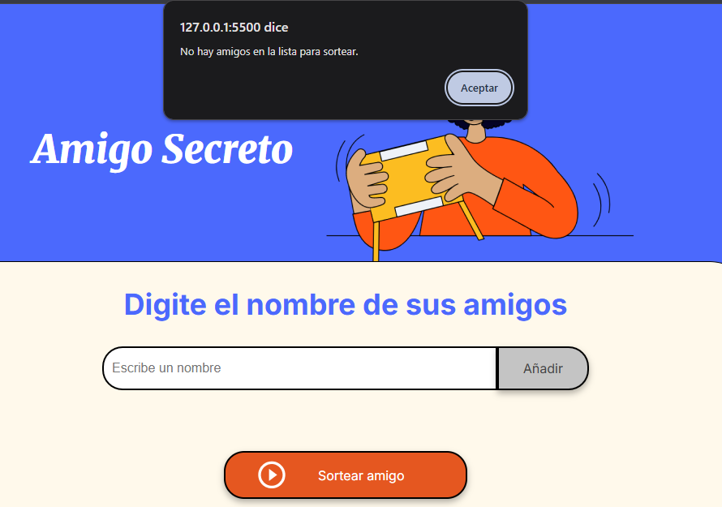
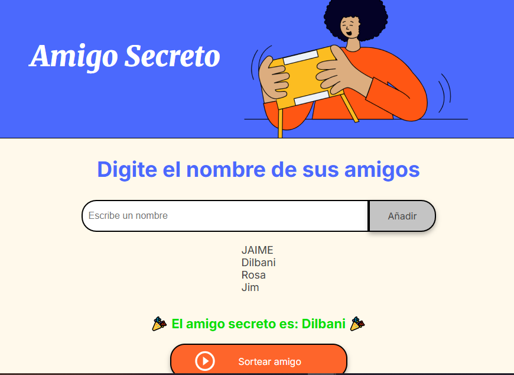
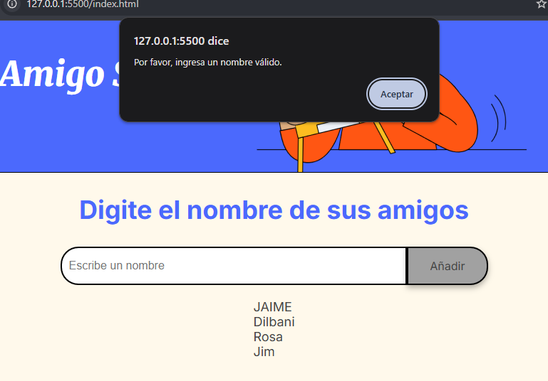

# Amigo Secreto 🎁

Este es un proyecto web interactivo para organizar un juego de "Amigo Secreto". Permite a los usuarios ingresar nombres de participantes y realizar un sorteo aleatorio.

## Funcionalidades 📌

- **Añadir nombres:** Los usuarios pueden escribir nombres en un campo de entrada y agregarlos a la lista de participantes.
- **Validación de entrada:** Si el usuario intenta agregar un nombre vacío, se muestra una alerta indicando que debe ingresar un nombre válido.
- **Sorteo aleatorio:** Una vez ingresados los nombres, se puede presionar el botón "Sortear amigo" para seleccionar un participante al azar.

## Capturas de pantalla 🖼️

### 1. Validación de entrada vacía ❌
Si el usuario intenta agregar un nombre vacío, aparece un mensaje de alerta:

### 2. Lista de participantes y sorteo ✅
Después de agregar nombres, la lista se muestra y se puede realizar el sorteo:

## Tecnologías utilizadas 🛠️

- **HTML, CSS y JavaScript** para la interfaz y funcionalidad.
- **Eventos de JavaScript** para manejar la validación y el sorteo.

¡Disfruta del juego de Amigo Secreto! 🎉

